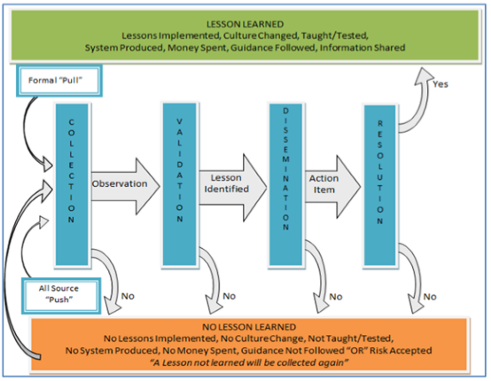

In the standard process of USAF LL identified in AFI 10-1302 (shown in
figure 1), there are a series of steps all LL proceed through. These
steps are collection, validation, dissemination, and resolution. This
standard process is open to interpretation and implementation for each
organization, but the broad strokes will be described.

Figure 1. Lessons Learned Process ( *Diagram per AFI 10-1302* )

During the Collection phase of a LL, an "Observation" is created and
submitted to the LL Manager by a member of the organization. This
Observation is catalogued for tracking, then validated at the
appropriate level and with the appropriate process owners and experts.
If the Observation is validated, it is assigned an action officer who
determines the necessary actions for implementation. The Observation
becomes a "Lesson Identified", and is disseminated to the appropriate
members of the organization. Once the AO has completed the
implementation actions, and all relevant members are notified and
trained on the changes, the Lesson Identified becomes a Lesson Learned
(Resolution).

