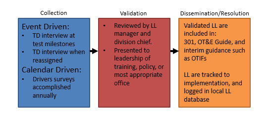

The AFOTEC LL process, illustrated in figure 2, adheres to the broad
strokes defined by policy and implements them in a mixed pull
(interviews/surveys) and push process (SharePoint).

Figure 2. AFOTEC Lessons Learned Process

The stand-alone LL submissions form can be found on the LL
[Sharepoint](https://cs2.eis.af.mil/sites/10008/functional/lessons/SitePages/Home.aspx)
site (example in Appendix A), along with contact information for the
current LL manager. The submission of LL by team members can be
performed at any time during a test program, and is encouraged while
memory of an event is still fresh. This process has a number of
benefits. For interviews it ensures that test directors, having
completed a test event and necessary reporting, are prepared and have
the necessary bandwidth to thoughtfully consider any lessons or problems
they encounter during the test program. Test team members are encouraged
to step back and give the organization its best opportunity to learn
from the challenges they encounter and solutions developed. Surveys
offer a focused opportunity to be directed by questions through the
different aspects of their duties and highlight issues they've
encountered in each. Finally, self-reported observations offer out-of-
sequence opportunities for team members to identify issues and solutions
they have uncovered during the normal accomplishment of their duties.

